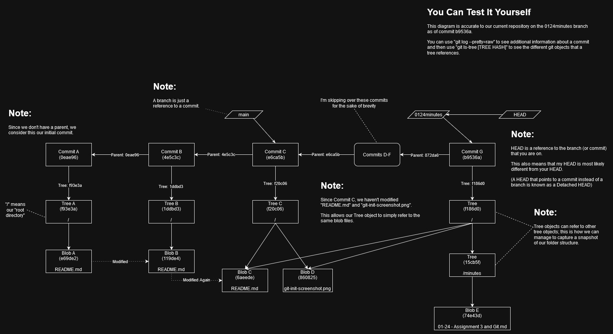
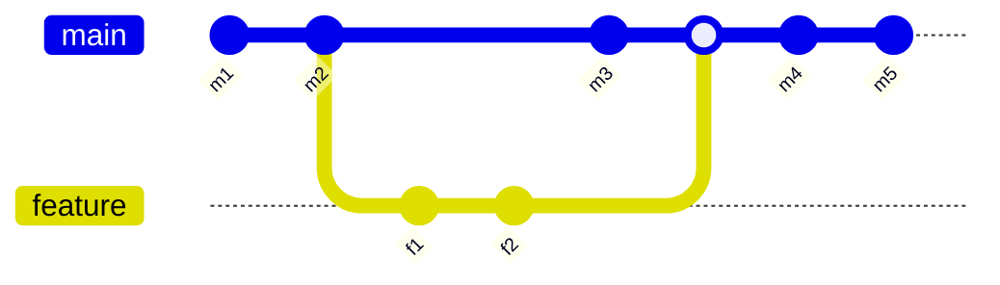

## Tasks

- [x] Accept Sid's invitation to the shared repo
- [ ] We've agreed on "Securing your personal data" as our topic for the wiki assignment. Choose your subtopic:
    - [ ] Koki: Occupational hazards in regards to security (clarify?)
    - [x] Tsujimoto: Security benefits of Linux (and/or?) Rust
    - [x] Bennet: Phishing emails
    - [x] Sid: Account security - passwords, password managers, and MFA
- [ ] Clone the wiki repo to your computer: create a new folder, then `git clone https://github.com/shorian/IT115.wiki.git`
- [ ] Write your first draft. Aim for 750 words or more: long enough to say something significant, but not overkilling the assignment
    - [Guide to formatting on GitHub](https://docs.github.com/en/get-started/writing-on-github/getting-started-with-writing-and-formatting-on-github/basic-writing-and-formatting-syntax)
    - Write locally, then commit and push to share with teammates
    - [ ] Sid: choose a realistic deadline that gives teammates time to provide feedback
- [ ] Write your section of the table of contents: Link to your page of the wiki and a brief summary

## Tsujimoto's git mini-lecture

If you `git init` in a directory, you will see a .git folder, which contains all the information git uses to keep track of history. This .git folder is our actual local repository.

Within the .git folder there are two folders that are relevant to understanding how Git works under the hood, the "objects" folder and the "refs" folder.

There are 4 different types of git objects which are all placed within the objects folder:
- Blob
  - An object that is a version of a file, compressed into a binary representation
- Tree
  - An object that holds references to blob objects and other tree objects; analogous to a snapshot of our filesystem
- Commit
  - An object that holds a reference to a tree object and to a previous commit object
  - **This is the primary object that allows us to keep track of our git history.**
- Tag
  - Not relevant for this, but if you're interested please read the documentation on [`git tag`](https://git-scm.com/docs/git-tag)
  - In short though it just exists to give extra information for a tag

References are placed within the "refs" folder within the repository; they are simply references to different git objects. For example, if you opened up the refs folder at the time of writing and opened the file `.git/refs/heads/0124minutes` within a text editor, you would see the hash: `b9536ac6a4655df93d60499c90bbf73859cdd31b` which happens to be a commit object. This will be different at the time you are reading this, but if you typed `git log` after switching to this branch, you would see that exact commit somewhere in our git history.

> Note:  
> Throughout this document I truncate the hashes to the first 6 digits. This isn't just to aid readability, it's also syntactic sugar that you can use within the terminal. You can type out: `git checkout b9536ac6a4655df93d60499c90bbf73859cdd31b` or `git checkout b9536a`. In fact, you can use any number of digits you want as long as there's enough to differentiate from other git objects. Typically 6 digits is enough to distinguish different objects from one another.

The point is that Git is kind of just based around these objects. When thinking in terms of git objects, you can clear up some possible misinterpretations.

> Note:  
> While talking about this I kind of pass over the fact that you **won't** see these objects after cloning a repository. This isn't because those objects don't exist, but instead because those objects end up being compressed into a pack file (which you can see within the "pack" folder). This compression helps with both storage space and speed. It's possible to unpack these objects, but there isn't any point in doing so.

In class, we were introduced to the concept of branches. We can have one branch with branches coming off of it, and they can merge back into each other.

(this is a [mermaid](https://mermaid.js.org/syntax/gitgraph.html) diagram!)

A git graph shows this relationship very well and helps us make sense of the various "timelines" that exist within our project. However, while thinking in terms of timelines can help ease a lot of the burden when managing a git repository, sometimes you **have** to remember that in reality we are working with git objects and references.

In this case, the feature branch is a reference that points to f2, and the main branch is a reference that points to m5. **Even though main and feature are two separate branches, f1 and f2 are a part of the main branch because the merge commit (which is in the history of main) references f2.**

Here is another example which can show that relationship a bit more clearly (taken from the [git documentation on branching and merging](https://git-scm.com/book/en/v2/Git-Branching-Basic-Branching-and-Merging)) **master contains both C4 and C5**:

Git is pretty smart about merging changes that don't conflict: even if you and a teammate edit the same file, as long as you were editing different *portions* of that file, git can merge those changes just fine. If you edited the same parts of the file, you have a merge conflict, and you need to deal with that manually. There are all sorts of tools to help you with that.

When you push to a remote repository, what you are doing is sending all your git objects to that remote repository. All of our history is tracked by the individual commit objects. We also push our references and will typically update a remote reference (a remote branch) to point to a new commit object.

Git is a decentralized source control system, which means that there's nothing special about a remote repository. If we instead chose to use the repositories on each others' machines as remote repositories (and went through the networking hassle of allowing HTTP/SSH connections through different ports on our router), we'd be able to pull/push to each other rather than Github. A remote repository is just that: a repository that isn't local to our machine.

### General Notes:

- `git log` shows you the commit you're on. You may notice that it gives you a hash that corresponds to a folder in your .git directory.
- A commit points to the previous commit and a tree object, which points to blobs and other tree objects.
- Within the refs folder are the following folders:
  - heads (the different branches you have locally)
  - tags (tags which refer to specific commits)
  - remotes (a collection of remote repositories)
    - origin (a remote repository, holds all references for that remote repository)
    - another (you can have another remote repository, but we typically only have one)
