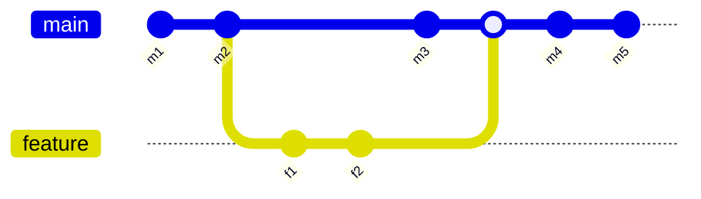

## Tasks
- [x] Accept Sid's invitation to the shared repo
- [ ] We've agreed on "Securing your personal data" as our topic for the wiki assignment. Choose your subtopic:
    - [ ] Koki: Occupational hazards in regards to security (clarify?)
    - [x] Tsujimoto: Security benefits of Linux (and/or?) Rust
    - [x] Bennet: Phishing emails
    - [x] Sid: Account security - passwords, password managers, and MFA
- [ ] Clone the wiki repo to your computer: create a new folder, then `git clone https://github.com/shorian/IT115.wiki.git`
- [ ] Write your first draft. Aim for 750 words or more: long enough to say something significant, but not overkilling the assignment
    - [Guide to formatting on GitHub](https://docs.github.com/en/get-started/writing-on-github/getting-started-with-writing-and-formatting-on-github/basic-writing-and-formatting-syntax)
    - Write locally, then commit and push to share with teammates
    - [ ] Sid: choose a realistic deadline that gives teammates time to provide feedback
- [ ] Write your section of the table of contents: Link to your page of the wiki and a brief summary

## Tsujimoto's git mini-lecture
If you `git init` in a directoy, you will see a .git folder, which contains all the information git uses to keep track of history

- 4 different git objects:
    - Blobs
    - Tree
    - Commits
    - Tags

Commit objects refer to a tree object, but not just to a tree object: also the previous commit object. This is how we track our history: every commit we make has a reference to the state of the file system in that commit, and points to the previous commit.

The point is that git is kind of just based around these objects. As long as you're thinking in terms of the commit objects, that clears up some possible misinterpretations.

In class, we were introduced to the concept of branches. We can have one branch with branches coming off of it, and they can merge back into each other.

(this is a [mermaid](https://mermaid.js.org/syntax/gitgraph.html) diagram!)

The feature branch points to commit f2.

Git is pretty smart about merging changes that don't conflict: even if you and a teammate edit the same file, as long as you were editing different *portions* of that file, git can merge those changes just fine. If you edited the same parts of the file, you have a merge conflict, and you need to deal with that manually. There are all sorts of tools to help you with that.

Git can fast-forward in some situations. (clarify when this happens and what it means)

`git log` shows you the commit you're on. You may notice that it gives you a hash that corresponds to a folder in your .git directory. A commit points to a tree object, which points to blobs.

Git references: different things that point to the different commit objects or hashes. The heads file - you see master? You're on the master branch. This is also how remote repositories work. If I go into the IT115 folder, this holds my own repo. If I go into `.git/refs`, it has heads, tags, and remotes. Heads shows main branch, remotes will have an additional folder in it called origin. You can have multiple remote repositories. Origin is the repo that's on github. I have the main branch there, and HEAD, which is a reference to the main branch.

If I open it up in notepad, you see that it just references remotes origin main.

If you're pushing to a remote repository, or pulling, you're just sending and receiving the git objects and references. The remote repo has all the data, and then you tell the repo, "Take this reference, and refer to this commit." That's how the remote repository knows where you are.

Git is a decentralized system, so it goes both ways: if it had a client, they'd be able to pull and push to our repositories if they had access to that.
